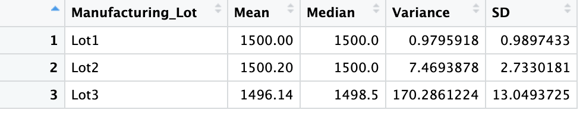

# MechaCar_Statistical_Analysis
AutosRUs is reviewing production data for a new prototype, the MechaCar, by leveraging the power of data analytics into its decision-making process for the first time. The metrics of the statistical analysis below include vehicle length, vehicle weight, spoiler angle, ground clearance and drivetrain.
## Linear Regression to Predict MPG
A key factor in automobile consumer decision-making is fuel efficiency, below is a linear regression model in order to predict the mpg of the MechaCar.

* Out of all the variables in the model, vehicle length and ground clearance provided a non-random amount of variance to the mpg values in the dataset.

* The slope of the linear model is not considered to be zero because the small p-value suggests a meaningful correlation between mpg and the independent variables.

* This linear model is a helpful first step in understanding how these variables relate to the MechaCar's mpg, but with a 71% accuracy rate this model alone is not a totally effective way of predicting mpg. 

## Summary Statistics on Suspension Coils
This analysis looks more closely at manufacturing processes across production facilities to determine if variance of the MechaCar's suspension coils are meeting the design specifications, which are not to exceed 100 pounds per square inch.

As shown in the total summary above, the variance across all manufacturers meets the standards set in the specifications. However, the individual lot summary shows that the variance for Lot 3 is dramatically above the standards and fails to conform to the design plans. 

## T-Tests on Suspension Coils
Below are the results of four t-tests in order to further explore how individual manufacturers differ from the population mean. By looking at the p-value of the results below, lot 3 is the only statistically different lot.

 

## Study Design: MechaCar vs Competition
In order to understand how the MechaCar compares to the competition AutosRUs requires further statistical analysis. Additional metrics will bring additional insights into consumer interests. Maintenance costs will help quantify affordability and value, and safety information will help quantify reliability. Industry-wide data about safety ratings and average maintenance costs will be necessary to run an ANOVA test, and understand how the MechaCar will compare to the competition.

